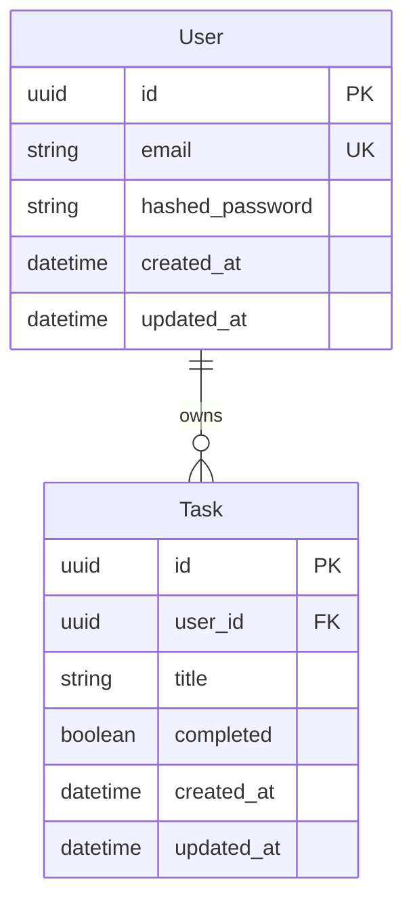

# Data Model: Full-Stack Todo Web Application

## Entities

### User

Represents an authenticated user account with email and credentials.

| Field | Type | Constraints | Description |
|-------|------|-------------|-------------|
| id | UUID | Primary Key, Default uuid4() | Unique user identifier |
| email | String(255) | Unique, Index, Not Null | User email address |
| hashed_password | String(255) | Not Null | Bcrypt hashed password |
| created_at | DateTime | Default datetime.utcnow | Account creation timestamp |
| updated_at | DateTime | Default datetime.utcnow | Last update timestamp |

**Validation Rules:**
- Email: Must be valid format, maximum 255 characters, unique
- Password: Minimum 8 characters, stored as bcrypt hash

**State Transitions:**
- Account created → active
- No state changes during lifetime (no deactivation in scope)

### Task

Represents a todo item owned by a specific user with title, completion status, and timestamps.

| Field | Type | Constraints | Description |
|-------|------|-------------|-------------|
| id | UUID | Primary Key, Default uuid4() | Unique task identifier |
| user_id | UUID | Foreign Key, Index, Not Null | Owner user identifier |
| title | String(255) | Not Null, Min 1 char | Task title |
| completed | Boolean | Default False | Completion status |
| created_at | DateTime | Default datetime.utcnow | Task creation timestamp |
| updated_at | DateTime | Default datetime.utcnow | Last update timestamp |

**Validation Rules:**
- Title: Non-empty, maximum 255 characters
- completed: Boolean, default False

**State Transitions:**
- Created → incomplete (default)
- incomplete ↔ complete (via toggle operation)
- Deleted → removed from database

## Relationships



**Cardinality:** One-to-Many
- One User can have many Tasks
- Each Task belongs to exactly one User

## Database Schema

### Users Table (PostgreSQL)

```sql
CREATE TABLE user (
    id UUID PRIMARY KEY DEFAULT gen_random_uuid(),
    email VARCHAR(255) NOT NULL UNIQUE,
    hashed_password VARCHAR(255) NOT NULL,
    created_at TIMESTAMP NOT NULL DEFAULT NOW(),
    updated_at TIMESTAMP NOT NULL DEFAULT NOW()
);

CREATE INDEX idx_user_email ON user(email);
```

### Tasks Table (PostgreSQL)

```sql
CREATE TABLE task (
    id UUID PRIMARY KEY DEFAULT gen_random_uuid(),
    user_id UUID NOT NULL REFERENCES user(id) ON DELETE CASCADE,
    title VARCHAR(255) NOT NULL,
    completed BOOLEAN NOT NULL DEFAULT FALSE,
    created_at TIMESTAMP NOT NULL DEFAULT NOW(),
    updated_at TIMESTAMP NOT NULL DEFAULT NOW()
);

CREATE INDEX idx_task_user_id ON task(user_id);
CREATE INDEX idx_task_user_completed ON task(user_id, completed);
```

## SQLModel Definitions

### User Model (Python)

```python
from sqlmodel import SQLModel, Field, Relationship
from datetime import datetime
from typing import List, Optional
from uuid import uuid4

class User(SQLModel, table=True):
    id: Optional[str] = Field(
        default_factory=lambda: str(uuid4()),
        primary_key=True,
        max_length=36
    )
    email: str = Field(max_length=255, unique=True, index=True)
    hashed_password: str = Field(max_length=255)
    created_at: datetime = Field(default_factory=datetime.utcnow)
    updated_at: datetime = Field(default_factory=datetime.utcnow)

    tasks: List["Task"] = Relationship(back_populates="user")
```

### Task Model (Python)

```python
class Task(SQLModel, table=True):
    id: Optional[str] = Field(
        default_factory=lambda: str(uuid4()),
        primary_key=True,
        max_length=36
    )
    user_id: str = Field(max_length=36, foreign_key="user.id", index=True)
    title: str = Field(max_length=255, nullable=False)
    completed: bool = Field(default=False)
    created_at: datetime = Field(default_factory=datetime.utcnow)
    updated_at: datetime = Field(default_factory=datetime.utcnow)

    user: "User" = Relationship(back_populates="tasks")
```

## Integrity Constraints

1. **Referential Integrity**: Task.user_id must reference existing User.id
2. **Cascade Delete**: Deleting a User deletes all their Tasks (ON DELETE CASCADE)
3. **Unique Email**: No two users can have the same email address
4. **Non-empty Title**: Task title must contain at least one character
